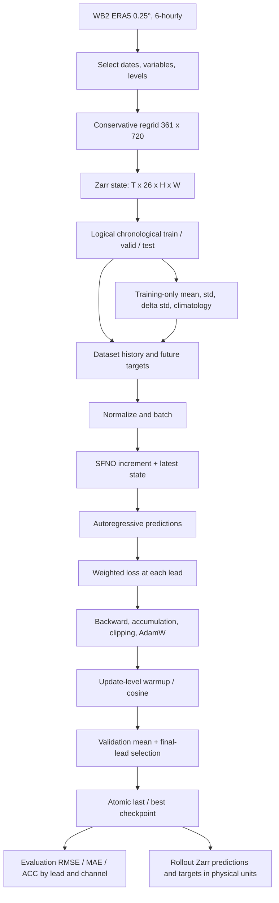

# Scientific + Mathematical + ML + Software Audit Report

**Project:** NeuralAtmosphereOperator

**Ngày audit:** 2026-09-06

**Snapshot:** commit `f3b3da3` — `Expand ERA5 training corpus to 24 years`
**Phạm vi:** toàn bộ 50 file Git quản lý: 42 Python, 2 notebook, README, cấu hình package/dependency/test/Git; metadata hai Zarr local và toàn bộ giá trị sample 26 kênh. Không sửa source, config, test gốc hoặc dữ liệu gốc. Các file mới trong `audit/` là báo cáo và bằng chứng kiểm chứng.

## 1. Kết luận và mức độ tin cậy

**Overall status: Significant issues.** Project có nền tảng hợp lý để làm baseline dự báo khí quyển bằng SFNO. Tuy nhiên, hiện chưa đủ bằng chứng để tin vào chất lượng dự báo khí tượng, và có các lỗ hổng có thể tạo ra evaluation sai, resume sai trajectory, hoặc làm pipeline thống kê không chạy nổi ở quy mô 24 năm.

| Tiêu chí | Verdict | Cơ sở |
|---|---|---|
| Overall status | **Significant issues** | Các phản ví dụ end-to-end xác nhận lỗi data contract và resume; validation/test quá hẹp |
| Code quality | **Good** | Phân tách module rõ, shape checks, checkpoint atomic, 40 test pass; còn lỗ hổng ở ranh giới module |
| Mathematical correctness | **Needs verification** | MSE, diện tích, normalization, BPTT đúng trong phạm vi kiểm tra; tuyên bố isotropic cho kernel phức không đúng tổng quát |
| Experimental validity | **Weak** | Không có trained checkpoint/log trong snapshot; bốn initialization gần nhau không đủ đánh giá tổng quát |
| Research potential | **High** | Có baseline kiểm chứng được để nghiên cứu forcing, closure, spectral stability và đánh giá probabilistic |

Không có bằng chứng để kết luận toàn bộ phương pháp **Fundamentally incorrect**. Cũng không thể chuyển từ “40 test pass” sang “Scientifically valid”. Những experiment vi phạm data contract ở C01 phải coi là **Invalid** riêng lẻ; chưa có bằng chứng người dùng đã chạy những experiment đó.

### 1.1 Quy ước bằng chứng

- **FACT / VERIFIED:** đọc trực tiếp implementation hoặc tái hiện bằng test; liên kết tới file bằng chứng.
- **INFERENCE:** hệ quả được suy ra từ công thức, luồng dữ liệu hoặc phép đo nhỏ; không trình bày như số đo production.
- **SUGGESTION:** cách sửa hoặc experiment cần làm; chưa triển khai.
- **Chưa đủ bằng chứng:** không có dữ liệu/chạy thử phù hợp để kết luận, đặc biệt về skill thật, CUDA, và rollout khí quyển dài hạn.

### 1.2 Giới hạn thực nghiệm của audit

Corpus `era5_1995_2019_0p5deg_26ch.zarr`, bộ statistics production, checkpoint đã train và logs nghiên cứu **không có trong workspace**. Chỉ có hai sample cùng ngày 2018-01-01, bốn trạng thái 6 giờ. Không tải corpus lớn và không chạy training dài.

Đã tạo venv tạm `/tmp/nao-scientific-audit-venv`, cài các direct dependencies đúng `requirements-lock.txt`, chạy kiểm chứng trên CPU và smoke test MPS. Không có CUDA. Venv kế thừa system site packages; các package ngoài project như torchvision/OpenCV có dependency conflict với bộ lock, nhưng không được import trong tests; pytest plugin auto-loading đã tắt. Phiên bản thực tế nằm trong [environment.json](evidence/environment.json).

## 2. Bản đồ repository và dependency

Danh sách đầy đủ, kích thước và SHA256 của **từng file gốc**: [repository_manifest.json](repository_manifest.json). Hai notebook đều chỉ có Markdown, không có code cell/output experiment. Chúng là tài liệu thiết kế, không phải bằng chứng thực nghiệm. `.git`, cache Python/pytest và `.DS_Store` không được coi là implementation.

| Nhóm | Các file đã đọc | Vai trò và dependency |
|---|---|---|
| Thiết kế/package | `README.md`, `pyproject.toml`, `requirements.txt`, `requirements-lock.txt`, `pytest.ini`, `.gitignore` | Mục tiêu, installation, discovery/package, test scope |
| Config | `configs/__init__.py`, `download_data_config.py`, `model_config.py`, `pipeline_config.py` | Channel contract; source/regrid; model; thời gian split và training defaults |
| Thu thập dữ liệu | `data/__init__.py`, `download_data.py`, `test_download_sample.py`, `explore_data.py` | WB2 → chọn trường/level/time → conservative regrid → Zarr; fingerprint/resume download |
| Data runtime | `src/neural_atmosphere_operator/data/{__init__,loader,normalization}.py` | Logical split, history/targets, normalization, noise, DataLoader |
| Model/loss | `src/neural_atmosphere_operator/models/{__init__,model,loss}.py` | Wrapper SFNO → thư viện torch-harmonics; MSE/relative/spectral/gradient scaling |
| Pipeline runtime | `pipeline/{__init__,runtime,dependencies,forecast,schedule,checkpoint,metrics}.py` | Device/AMP/RNG; runtime guards; BPTT; scheduler; persistence; metrics |
| Package/log | `src/__init__.py`, `src/neural_atmosphere_operator/__init__.py`, `utils/{__init__,logger}.py` | Export API và logging |
| Data CLI | `scripts/{compute_stats,split_dataset,validate_data}.py` | Train statistics; tùy chọn materialize split; sanity validation |
| Training/inference CLI | `scripts/{train,evaluate,rollout,plot_results}.py` | Train/selection; forecast scoring; xuất trường vật lý; plot |
| Diagnostic CLI | `scripts/{analyze_gradient_risks,audit_training_readiness,benchmark_model,benchmark_sample,check_backend,estimate_vram}.py` | Gradient/compute/storage/backend probes; không phải kết quả forecast chính thức |
| Tests | `test/{test_model_and_loss,test_data_pipeline,test_pipeline,test_checkpoint_resume}.py` | Loss/shape/data, scheduler/ACC/BPTT, checkpoint state |
| Notebook | `notebook/01_model_architecture.ipynb`, `02_data_exploration.ipynb` | Công thức, kiến trúc, channel/unit/regrid/storage claims |

Đã đọc thêm đường tính thực sự của dependency khóa: `torch_harmonics/examples/models/sfno.py`, `_layers.py` và scalar `sht.py`; đối chiếu Makani tại commit `037ccdeb7f9cf5b3001959ad9366b2b287ba562d`. Việc review wrapper mà bỏ qua dependency này sẽ bỏ sót H04, M04 và M05 bên dưới.



### 2.1 Pipeline mặc định thực sự

1. WB2 archive có source grid 721×1440, 6 giờ, 13 pressure levels. Chọn 6 surface channels và 20 variable-level channels; regrid tuyến tính theo diện tích ô; lưu float32 `[T,26,361,720]`, chunk một trạng thái đầy đủ.
2. Một Zarr chứa toàn bộ thời gian; `build_loader` áp logical split **chỉ khi path bằng chính xác canonical dataset path**. Với override path, đọc toàn bộ store đó.
3. Train: 1995–2018, **35,064 states**, **35,063 one-step windows**. Valid: 2019-01-01..16, 64 states; K=60 chỉ có **4 starts trong ngày 01-01**. Test: 2019-01-17..02-16, 124 states; K=120 chỉ có **4 starts trong ngày 01-17**.
4. `compute_stats.py` tính spherical-area-weighted mean/std, std của chênh lệch theo stride, và climatology trung bình thời gian tại từng ô, chỉ trên train range. Normalization được thực hiện bằng statistics chung cho từng channel.
5. Default history=0: input `[B,26,H,W]`, target `[B,K,26,H,W]`. Nếu history=h, input ghép từ cũ đến mới thành `(h+1)×26` channels. `time_index` dùng làm metadata; **không đưa timestamp vào model**.
6. SFNO trả increment chuẩn hóa; wrapper cộng vào state mới nhất. Rollout chuyển prediction thành input bước tiếp theo, không teacher forcing và không detach.
7. Loss chính là channel-weighted spherical MSE với temporal-difference scaling; loss mỗi lead được tính rồi lấy trung bình có discount. Các auxiliary losses/noise/gradient scaler tắt mặc định.
8. AdamW: LR `5e-4`, betas `(0.9,0.95)`, decay `1e-4`, batch4×accumulation2, clipping1.0. Warmup 3 epochs; cosine horizon25; LR floor `1e-6`. BF16 autocast chỉ trên CUDA, GradScaler chỉ bật với FP16.
9. Validation autoregressive60; selection `0.5 × mean_lead_loss + 0.5 × final_lead_loss`. Training horizon mặc định1 không bằng validation horizon60. Checkpoint chứa numerical state và fingerprints.
10. `evaluate.py` dùng checkpoint model, normalization/climatology, cùng autoregressive helper; `rollout.py` denormalize và lưu cả forecast lẫn target. Inference CLI vẫn cần đủ future observations, xem H07.

## 3. Danh sách vấn đề ưu tiên

**22 vấn đề:** 1 Critical, 8 High, 11 Medium, 2 Low. Trong các tham chiếu dưới đây, `models/`, `pipeline/`, `utils/` và `data/loader.py`, `data/normalization.py` nằm dưới `src/neural_atmosphere_operator/`; `data/download_data.py` và các script thu thập dữ liệu nằm tại `data/` ở project root.

Mức độ dưới đây áp dụng cho **hậu quả nếu trigger xảy ra**, không hàm ý mọi run hiện có đều mắc lỗi. Không có evidence về một trained production run trong repository.

| ID | Severity | Vấn đề | Trigger / phạm vi |
|---|---|---|---|
| C01 | **CRITICAL** | Evaluation/inference không khóa cadence, geographic grid, units và held-out provenance | Đổi `--data-path` hoặc nội dung data store |
| H01 | **HIGH** | Validation/test dài hạn chỉ có bốn initialization tương quan, một mùa | Default experiment design |
| H02 | **HIGH** | Statistics graph giữ lượng dữ liệu tăng theo toàn corpus | Default `compute_stats.py` trên corpus lớn |
| H03 | **HIGH** | Gradient không hữu hạn vẫn cập nhật model khi scaler tắt | Default BF16/FP32, nếu NaN/Inf xuất hiện |
| H04 | **HIGH** | Kernel phức không bảo đảm isotropic/SO(3) convolution như notebook mô tả | Default complex kernel; sai claim toán học |
| H05 | **HIGH** | Resume cho phép đổi warmup factor hoặc số sample mà không báo mismatch | `--resume` với thay đổi lọt guard |
| H06 | **HIGH** | Chưa có evidence/baseline/physical diagnostic đủ chứng minh skill và stability | Mọi kết luận về efficacy dài hạn |
| H07 | **HIGH** | CLI “inference” đòi có toàn bộ future targets | Dự báo sau timestamp cuối hoặc horizon ngoài dataset |
| H08 | **HIGH** | Statistics provenance chưa được ràng buộc bắt buộc theo từng artifact | Missing `stats.json`, mixed override statistics |
| M01 | **MEDIUM** | Relative loss có gradient NaN tại nghiệm đúng | Auxiliary loss bật |
| M02 | **MEDIUM** | State dimension order không được validate/transpose | Zarr có dimensions đổi thứ tự |
| M03 | **MEDIUM** | Reproducibility claim mạnh hơn fingerprint/determinism thực tế | Đổi backend settings, dependency hoặc data payload |
| M04 | **MEDIUM** | `use_complex_kernels=False` không có tác dụng | Python configuration ablation |
| M05 | **MEDIUM** | SC1 trộn residual trên hai grid; L1+LayerNorm sai shape | Config được schema chấp nhận nhưng không an toàn |
| M06 | **MEDIUM** | Normalization gần trường hằng khuếch đại sai số transform | Low-variance/constant hidden state |
| M07 | **MEDIUM** | Eager targets và nhiều CPU↔GPU synchronization | Default long validation/eval |
| M08 | **MEDIUM** | Empty evaluation có thể báo RMSE=0; metadata output thiếu | `--max-samples 0`; reuse output directory |
| M09 | **MEDIUM** | Hai hàm compute statistics dùng measure khác nhau | Dùng API helper thay production CLI |
| M10 | **MEDIUM** | Benchmark sample cho phép validation target thuộc training | Batch3 với sample 4 states |
| M11 | **MEDIUM** | Downloader reset phase cadence theo batch | Stride18h hoặc stride không khớp batch length |
| L01 | **LOW** | Sample local lỗi thời về unit metadata; một số hướng dẫn chưa đồng bộ | Commands README trên workspace hiện tại |
| L02 | **LOW** | Logging/history/auxiliary API còn có điểm gây hiểu nhầm | Plot train-vs-valid, resume snapshot cũ, dead API |

### C01 — Evaluation có thể tạo kết quả khoa học sai mà không bị chặn

**FACT / VERIFIED. Vị trí:** `scripts/evaluate.py:155–201` (`main`), `scripts/rollout.py:91–116` (`main`), `pipeline/runtime.py:103–120` (`build_loader`), `pipeline/runtime.py:140–157` (`checkpoint_time_step`).

Guard kiểm tra `time_step` như số **index**, nhưng không so `dataset.cadence_hours` với cadence train. Vì vậy model học `Δt=1×6h` được áp một lần và so với target `1×12h`; output báo 12 giờ như thể đó là horizon được train. Formula cần khóa là `Δt_model = time_step_train × cadence_train`, không chỉ `time_step`.

`spatial_crop=model_config.img_size` luôn được truyền trong eval/rollout. Shape đúng không chứng minh grid đúng: một vùng 20°×23° cũng được hiểu là toàn cầu; lưới lớn hơn bị cắt góc thay vì regrid. Không đối chiếu latitude orientation, longitude origin, actual coordinate arrays hoặc physical units với training. Climatology là `.npy` không có coordinates nên có thể bị đặt lên grid khác theo index.

Với override path, logical split bị bỏ; không đối chiếu với train interval của checkpoint. Đã chạy `--split test --data-path <train.zarr>` thành công, báo thời gian 1995 của training như test. Đây là đường **có thể gây leakage**, không phải bằng chứng canonical splits đang leakage.

**Bằng chứng:** [integration.json](evidence/integration.json): `evaluation_wrong_cadence` thành công và lead 1 = 12h; shifted longitude, regional grid và training-as-test đều exit 0, **không dùng** `--allow-data-mismatch`.

**Hậu quả:** RMSE/ACC chấm sai bài toán, climatology lệch vị trí, hoặc test bị contamination. Những score này không dùng làm kết luận nghiên cứu.

**SUGGESTION:** một forecast data contract chung cho train/eval/rollout: canonical dimension order, channel names/units, actual grid coordinates hoặc coordinate hashes, forecast hours, allowed evaluation intervals. Eval `valid/test` phải kiểm tra không overlap training. Tách diagnostic overrides rõ ràng và lưu mọi override trong output manifest. Dữ liệu độ phân giải khác cần regrid có chủ đích, không crop. Không so test data fingerprint phải bằng train data fingerprint: chúng khác split nhưng phải chung semantic contract.

**Training lại?** Không cần nếu model đã train đúng và chỉ scoring sai: chạy lại evaluation. Cần train lại nếu training đã dùng sai units/grid/normalization hoặc held-out information. Chưa đủ bằng chứng xác định trường hợp nào xảy ra ở run ngoài workspace.

### H01 — Validation và test không đủ đại diện

**FACT. Vị trí:** `configs/pipeline_config.py:35–43` (`DataPaths.split_time_range`); `data/loader.py:274–288`; `scripts/train.py:282–286`; `configs/download_data_config.py:76–78`.

Với K60, sample index 0..3 tương ứng 00/06/12/18 UTC cùng ngày. Hai target windows kế nhau overlap **59/60 timestamp**; test K120 overlap **119/120**. Bốn UTC phases không phải bốn weather cases độc lập như comment download config ám chỉ. Validation nằm ngay sau train; test chỉ 31 ngày mùa đông Bắc bán cầu. Calendar split disjoint là đúng, nhưng không tạo IID initialization.

**Cơ sở:** `N_windows=T−(h+K)s`. Độ chính xác thống kê phụ thuộc số event/initialization độc lập và coverage mùa, không phải số pixels×leads. Với terminal weight 0.5, riêng lead 60 có weight `0.5+0.5/60≈0.5083`; checkpoint selection tập trung vào bốn trạng thái target cuối rất tương quan.

**Hậu quả / INFERENCE:** ranking checkpoint dễ phụ thuộc một episode; manual selection qua unlimited epochs có thể overfit validation; không suy rộng ra forecast skill cả năm/khí hậu/tropics/extremes.

**SUGGESTION:** giữ fixed starts cho so sánh lead curves, nhưng dùng nhiều initialization trải đều các mùa trong một validation year và một test year tách biệt. Với compute nhỏ, chấm một panel 16–32 starts phân tầng theo mùa cho screening; đây vẫn là pilot, không substitute cho final evaluation lớn. Báo uncertainty bằng block bootstrap theo initialization/day/weather episode, không bootstrap pixel độc lập. Đổi selection sang mục tiêu horizon phục vụ use case, báo đồng thời 1/3/5/10/15d; 30d nên tách deterministic skill và distribution stability.

**Training lại?** Re-evaluate checkpoint có sẵn trước. Chọn lại checkpoint/fine-tune khi dùng validation mới; cần run lại nếu previous model/hyperparameter selection đã dựa trên test hoặc không còn checkpoint để so sánh công bằng.

### H02 — Statistics pipeline không có bounded-memory reduction

**FACT / VERIFIED. Vị trí:** `scripts/compute_stats.py:54–90` (`spherical_channel_statistics`), `157–159` (`main`).

Mean được tính toàn thời gian; variance dùng `(state−mean)^2`. Dask phải giữ state chunks cho variance trong khi chờ global mean; delta branch gặp cùng barrier. Gom tất cả statistics vào một `.compute()` giúp tránh đọc lại nhưng đánh đổi bằng giữ dataset trong cache. Lazy không đồng nghĩa streaming với RAM cố định.

**Bằng chứng:** probe generated chunks 16/64/256 giữ cache xấp xỉ 2×input bytes; probe **đọc Zarr thực** 32/128 chunks cũng đạt 2.003/2.001×. Xem [data-probes.json](evidence/data-probes.json), [probes.json](evidence/probes.json). Đo là array bytes trong scheduler cache, không phải full process RSS.

**INFERENCE quy mô production:** 35,064 training states ×27,031,680 bytes = **947.84GB /882.74GiB** raw. Nếu scaling giữ nguyên, riêng cached arrays tiến tới khoảng **1.73TiB**, chưa tính overhead/threaded scheduler. Không chạy corpus lớn để chứng minh exact peak, nhưng linear retention đã được tái hiện. `compute_stats.py` không cấu hình distributed spill để khắc phục.

**SUGGESTION:** Welford/Chan weighted sufficient statistics theo time chunk (float64 mean/M2/count), stream time_mean sum và delta moments cùng pipeline; giữ một rolling buffer dài `time_step`. Hoặc làm hai pass đọc store, hy sinh I/O để giới hạn RAM. Không ưu tiên `E[x²]−E[x]²` thuần float32 cho pressure/geopotential vì cancellation. Giữ joint-channel reading, tránh 26 lần decompress một chunk.

**Training lại?** Không nếu means/stds/climatology cũ đúng và thuật toán mới tương đương trong tolerance. Nếu statistics trước bị tính thiếu chunk, hoặc normalization đổi đáng kể, phải tính lại và train baseline tương ứng.

### H03 — Non-finite gradient làm hỏng weights và optimizer

**FACT / VERIFIED. Vị trí:** `scripts/train.py:587–590`, `787–810` (`main` training loop).

**Functions/classes liên quan:** `train.main` — accumulation/update/checkpoint loop.

Default BF16 và FP32 có disabled scaler. `clip_grad_norm_` dùng `error_if_nonfinite=False`; khi norm NaN, code chỉ tăng counter, rồi vẫn `scaler.step(optimizer)`. Disabled scaler gọi optimizer trực tiếp. NaN gradient làm AdamW moments và weights NaN; scheduler vẫn tiến. Với epochs=0/patience=0, run có thể tiếp tục vô hạn và ghi đè `last.pt` bằng state hỏng.

**Cơ sở:** clipping `g←g·min(1,τ/||g||)` không chữa NaN; `Inf×0` cũng có thể NaN. Log nonfinite không phải recovery. Probe một parameter theo đúng step ordering xác nhận parameter trở thành nonfinite.

**SUGGESTION:** kiểm tra finite loss và norm; fail fast hoặc skip **toàn accumulation bucket**; zero gradients, không step scheduler/completed_updates khi update bị hủy. Không ghi đè last-good checkpoint bằng nonfinite state. Khi FP16 scaler bật, vẫn cần guard loss/validation và xử lý repeated overflow; không kết luận BF16 an toàn chỉ vì exponent range rộng.

**Training lại?** Khôi phục checkpoint finite trước sự cố, không nhất thiết từ đầu. Nếu không có checkpoint lành hoặc không xác định được mốc corruption: train lại.

### H04 — Kernel phức phá tuyên bố isotropic scalar convolution

**FACT / VERIFIED. Vị trí:** `configs/model_config.py:37,39`; `models/model.py:58`; dependency `SpectralConvS2.forward`; notebook 01 cells 11/28.

Notebook viết `ẑ_lm=A_l v̂_lm`, `A_l∈C`, shared mọi m, rồi suy ra isotropic. Với **real scalar field**, cần `v̂_l,−m=(−1)^m conjugate(v̂_lm)`. Nếu nhân cùng `A_l` cho cả ±m thì relation này chỉ được giữ với ma trận thực. Implementation chỉ lưu m≥0; inverse real FFT tự dựng nhánh âm bằng liên hợp. Vì vậy nhánh âm thực chất nhận `conjugate(A_l)`, còn m0 bỏ imaginary part. Operator đó không phải một scalar multiplier đồng nhất trên toàn degree representation khi `Im(A_l)≠0`.

**Phản ví dụ analytic:** chọn `A_1=i`, `f=z=cosθ`. Khi đó `K(z)=0` vì m0 bị loại phần ảo. Quay 90° để `Rz=x=sinθ cosλ`, `K(Rz)` có biên độ 1. Vậy `K(Rz)≠R K(z)=0`. Probe cho `max|Kz|=0`, `max|K(Rz)|≈0.99999994`; real-kernel control và SHT roundtrip chỉ sai `2.38e−7`.

Đây là sai claim **ngay trong scalar spectral sublayer**, ngoài giới hạn vector-wind đã được notebook thừa nhận. InstanceNorm dùng spatial pixel moments cũng không bảo đảm full rotational invariance; không thể sửa complex weights rồi tự động khẳng định toàn network SO(3)-equivariant.

**Hậu quả:** không được dùng isotropy/equivariance làm bảo đảm khoa học cho model hiện tại. Điều này không chứng minh model forecast kém: khí quyển trên Trái Đất quay có preferred axis và forcing địa lý; exact SO(3) symmetry của bài toán cũng không phải assumption mặc định đúng.

**SUGGESTION / trade-off:** (a) giữ architecture, mô tả trung thực là spherical spectral network có symmetry hạn chế; (b) nếu nghiên cứu isotropic scalar operator, triển khai real degree kernels và weighted normalization, test commutator với rotations; (c) nếu mục tiêu physics của gió, xem vector/tensor harmonics và biến đổi forcing/rotation axis nhất quán. Không bật `use_complex_kernels=False` để sửa vì M04.

**Training lại?** Chỉ sửa claim: không. Thay parameterization/normalization: cần controlled retraining; có thể warm-start real parts nhưng đó là một experiment khác.

### H05 — Exact-resume guard bỏ sót numerical configuration

**FACT / VERIFIED. Vị trí:** `scripts/train.py:579–640,647–657`; `pipeline/schedule.py:52–60`; `pipeline/runtime.py:213–236` (`dataset_signature`).

`warmup_start_factor` có trong `vars(args)` được lưu, nhưng không trong `resume_signature` được so. LambdaLR không serialize closure: sau load state, lambda mới vẫn dùng factor mới. `max_samples` cũng không trong signature; dataset_signature mô tả time range của store, không actual sample indices/count. Nếu thay count mà vẫn cùng số updates/epoch, guard cũng không thấy.

**Bằng chứng end-to-end:** CPU train 2 epochs, checkpoint snapshot cuối epoch 0. Same config resume: max weight error **0**. Đổi warmup 0.1→0.9: được chấp nhận, max error **2.74219e−4**. Đổi max_samples 17→18 cùng update count: được chấp nhận, max error **5.81447e−4**. Probe scheduler riêng cho next LR 0.00037 so với 0.00093. Xem [integration.json](evidence/integration.json).

**SUGGESTION:** normalize training config một lần và so toàn bộ fields ảnh hưởng numerics, bao gồm scheduler arguments, effective sample-index list/hash, crop, train/valid sample count. Rebuild scheduler từ saved config cho exact resume. Dùng riêng `--init-checkpoint` cho curriculum/config mới; đó là phân biệt đang đúng về thiết kế.

**Training lại?** Không cho uninterrupted run và same-config resume đã kiểm chứng. Run đã vô tình thay đổi: tiếp tục từ checkpoint trước thay đổi với config gốc để có exact trajectory; không cần hủy mọi trained weights nếu chỉ cần một fine-tuning run được khai báo đúng.

### H06 — Chưa chứng minh được skill, physical plausibility hoặc rollout stability

**FACT. Vị trí:** `scripts/evaluate.py:202–257`; `pipeline/metrics.py:19–159`; `scripts/train.py:824–938`; notebook 01 cells 18/28.

**Functions/classes liên quan:** `evaluate.main`, `train.validate`, `LeadMetricAccumulator`.

Evaluation có RMSE/MAE/ACC lead-wise đúng nghĩa số học đã test, nhưng không có persistence/climatology baseline, seasonal reference, region/extreme stratification, bias/spectral-power/physical-budget diagnostics, uncertainty hay trained results. Chưa đủ bằng chứng nói model vượt baseline. Bốn starts cũng không đủ cho claim 30-day forecasting skill.

**INFERENCE:** deterministic MSE khuyến khích conditional mean khi target phân kỳ; forecast mượt có thể giảm RMSE nhưng mất variance/extremes. Annual-mean climatology giữ seasonal anomaly trong ACC, nên seasonal pattern có thể làm score dễ hơn day-of-year climatology. README đã phân biệt definition này với WB2: đó là minh bạch đúng, không phải bug formula.

**Bằng chứng giới hạn:** toy model overfit một sample giảm loss từ 1.47737 xuống0.0057789; khi lặp 120 bước, RMS tăng tới 6.89e7 dù mọi giá trị vẫn finite. Đây **không phải** forecast ERA5, chỉ chứng minh finite và one-step fit không suy ra rollout stability.

**SUGGESTION:** chấm persistence, training climatology và seasonal climatology cùng starts; physical RMSE theo channel/region, bias, variance ratio, spectra và nonphysical fractions. Với 30d, thêm ensemble/distribution diagnostics. Theo dõi mass proxy và water budget nhưng không ép total energy/water hằng vô lý trong khí quyển có forcing/sinks.

**Training lại?** Bổ sung evaluation trước. Chỉ train/fine-tune lại khi có failure mode hoặc mục tiêu mới; không tăng model capacity để thay cho kiểm chứng.

### H07 — Inference CLI không dự báo từ observed history đơn thuần

**FACT. Vị trí:** `scripts/rollout.py:104–119,165–179`; `data/loader.py:275–288,403–412`; `pipeline/forecast.py:24–25`.

Dataset luôn yêu cầu có K future targets và giảm length theo horizon. `autoregressive_predictions` cũng yêu cầu target tensor. Vì vậy không thể forecast từ timestamp mới nhất ra ngoài cuối observed store; muốn 120 steps phải có sẵn 120 observations. Chương trình thực chất là hindcast/export pipeline.

**Không có target leakage trong model forward:** target chỉ được yield cho loss/output; prediction feedback không lấy groundtruth. Bug là API và khả năng triển khai, không phải teacher forcing ngầm.

**SUGGESTION:** tách iterator `forecast(initial_history, steps, forcing)` không nhận target; evaluation zip prediction với optional truth. Tạo valid times từ trained timestep. Stream output và optional verification targets. `model.rollout` đã không cần targets nhưng đang giữ toàn list forecast; nên có generator dùng chung.

**Training lại?** Không; chỉ thêm inference path và train/eval equivalence tests.

### H08 — Provenance của normalization chưa đủ bắt buộc

**FACT. Vị trí:** `scripts/train.py:418–441,490–499`; `scripts/compute_stats.py:225–258`; `scripts/evaluate.py:159–172`.

**Functions/classes liên quan:** `train.main`, `compute_stats.main`, `evaluate.main`.

Canonical `compute_stats` chỉ đọc train, đây là điểm đúng. Nhưng training cho chạy khi thiếu `stats.json`, chỉ warning. Nếu metadata tồn tại, chỉ đọc file cạnh means; không chứng minh stds/climatology/delta override thuộc chính bundle đó. Metadata không lưu hash của từng output array, grid coordinates hoặc data content. Eval so statistic hashes với checkpoint chỉ bảo đảm dùng lại đúng files mà training đã dùng; không chứng minh train-only provenance ban đầu.

**Hậu quả / INFERENCE:** có thể train/eval nhất quán trên statistics bị leakage, sai channel order hoặc sai unit scale. Không có bằng chứng leakage ở statistics production vì chúng chưa tồn tại local.

**SUGGESTION:** immutable statistics bundle gồm ordered channels+units, coordinate hashes, train-range/sample manifest, cadence+stride, algorithm version, SHA256 của từng artifact và dataset version. Bắt buộc verify bundle ở training; explicit diagnostic bypass phải ghi manifest và không cho đánh dấu official result. Viết bundle vào thư mục tạm rồi rename để tránh interrupted stats generation trộn file cũ/mới.

**Training lại?** Nếu chỉ thiếu metadata và có thể xác minh/recompute ra cùng statistics: không. Nếu statistics có dùng held-out data hoặc sai semantics: train lại baseline sạch; score cũ không dùng làm bằng chứng held-out.

### M01 — Relative L2 loss có gradient không xác định tại zero error

**FACT / VERIFIED. Vị trí:** `models/loss.py:234–251`, `ChannelRelativeAtmosphereLoss.forward`.

Numerator là `sqrt(sum(w·error²))`; khi error=0, chain rule trong implementation đi qua derivative vô hạn của sqrt rồi nhân 0, sinh NaN. Denominator được clamp không sửa numerator. Probe prediction=target=1 cho loss 0 nhưng **80/80 gradient entries NaN**.

**SUGGESTION / trade-off:** dùng `torch.linalg.vector_norm` trên weighted error với zero subgradient được backend hỗ trợ, hoặc smooth norm `sqrt(E+eps²)−eps`; lựa chọn sau thay objective gần 0 nên phải ghi rõ epsilon. Test perfect prediction, target 0, tiny errors và numerical gradients. Notebook dùng `||target||+eps` trong khi code dùng `max(||target||,eps)`; sửa mô tả khớp formula.

**Training lại?** Không ảnh hưởng default weight 0. Ablation đã bị NaN cần resume từ last-good; ablation đổi smooth loss cần ghi nhận objective mới.

### M02 — Loader có thể nhầm channel và spatial axes

**FACT / VERIFIED. Vị trí:** `data/loader.py:130–135,336–369`, `_inspect_dataset` và `_read_timestep_channels`.

State chỉ được kiểm tra có dimension `channel`, nhưng không assert tuple dimensions. `np.asarray` không reorder theo tên. Store `[time,latitude,channel,longitude]` được chấp nhận; returned input là `[13,26,24]` thay vì `[26,13,24]`. Grid/channel lengths trùng nhau còn có thể tạo silent semantic mismatch; thông thường forward shape check mới bắt được. Legacy variables cũng dựa vào thứ tự dimensions khi đọc.

**SUGGESTION:** canonical `.transpose('time','channel','latitude','longitude')` sau validate exact dims; legacy surface transpose lat/lon, level transpose level/lat/lon. Test dimension permutations với kích thước bằng nhau để không chỉ dựa shape mismatch.

**Training lại?** Store từ current downloader có đúng order, không cần. Nếu đã train trên tensor bị đảo nghĩa mà shape vẫn qua: phải train lại.

### M03 — Seed và checkpoint chưa đủ để cam kết bitwise reproducibility

**FACT. Vị trí:** `pipeline/runtime.py:26–32,213–236`; `pipeline/dependencies.py:19–37,62–116`; `pipeline/checkpoint.py:92–125`.

**Functions/classes liên quan:** `seed_everything`, `dataset_signature`, `source_tree_sha256`, `capture_rng_state` và `restore_rng_state`.

Python/NumPy/Torch/CUDA/MPS RNG và loader generator được lưu đúng. Tuy nhiên không bật hoặc lưu deterministic algorithm policy, TF32/matmul precision, cuDNN settings, GPU model/driver, CPU threading, toàn bộ package versions. Dataset signature dùng metadata size/mtime; sửa data chunk không đổi metadata vẫn có thể lọt. Hash project không hash installed dependency source. `source_tree_sha256` còn giả định source checkout layout; nếu build wheel và cài ở site-packages, root suy ra không còn là project root nên phải kiểm tra lại provenance path.

**Hậu quả:** exact resume đã chứng minh ở CPU same environment không chứng minh bitwise same trên CUDA, máy khác hoặc payload dataset thay đổi. PyTorch cũng phân biệt seed và deterministic backend behavior trong [tài liệu reproducibility](https://docs.pytorch.org/docs/2.11/notes/randomness.html).

**SUGGESTION:** hai mức reproducibility rõ ràng: scientific repeatability theo distributions/CI và exact continuation cùng hardware/software settings. Lưu resolved config, version/hashes dependencies quan trọng, commit+dirty status, data manifest, backend precision flags, hardware/driver. Bật deterministic mode cho regression nhỏ trước; đo cost và unsupported ops trên target GPU trước khi bắt buộc toàn training.

**Training lại?** Không chỉ vì thiếu metadata. Muốn chứng minh robustness cần repeat seeds trên protocol khóa; không thể hồi tố cam kết bitwise equivalence khi provenance thiếu.

### M04 — `use_complex_kernels=False` là config không có hiệu lực

**FACT / VERIFIED. Vị trí:** `configs/model_config.py:37`; `models/model.py:58`; dependency `SphericalFourierNeuralOperatorNet.__init__` và `SpectralConvS2.__init__`.

Wrapper truyền argument đúng; dependency 0.7.4 nhận nhưng không sử dụng, luôn tạo `complex64`. Cùng seed, True/False tạo **parameters và outputs giống hoàn toàn**. Đây là lý do phải audit đường dependency, không chỉ kiểm tra constructor signature.

**SUGGESTION:** cho schema fail fast nếu False trong backend khóa, hoặc triển khai real-kernel path và test dtype/parameterization/functionality. Không trình bày một run False là real-kernel ablation khi chưa sửa.

**Training lại?** Default True không cần. “Real vs complex” experiment đã dùng flag False cần chạy lại nhánh real thực; dữ liệu trước không chứng minh khác biệt hai phương pháp.

### M05 — Một số cấu hình hợp lệ theo schema nhưng sai implementation

**FACT / VERIFIED. Vị trí:** `configs/model_config.py:48–96`; `models/model.py:_build_sfno`; dependency `SpectralConvS2.scale_residual` và SFNO norm selection.

**Functions/classes liên quan:** `AtmosphereModelConfig.__post_init__`, `_build_sfno`, `SpectralConvS2.forward` và upstream `SphericalFourierNeuralOperatorNet.__init__`.

1. **SC1 + equiangular→Legendre–Gauss:** transform grids khác nodes nhưng cùng H/W. Dependency chỉ xét kích thước để resample residual; `scale_residual=False`, nên cộng equiangular residual vào GL representation theo index. Probe low-degree field có max residual mismatch **0.0647575**, lớn hơn roundoff nhiều bậc. Đây là lỗi discretization của ablation SC1, không xảy ra default SC2 có shape đổi.
2. **num_layers=1 + LayerNorm:** block đầu đồng thời cuối dùng inverse về full grid, nhưng norm được chọn theo first-layer branch là internal shape. Probe báo expected `[5,8]`, received `[13,24]`.
3. `hard_thresholding_fraction` chỉ kiểm tra >0; với grid nhỏ có thể tính modes=0. SHT API dùng `lmax or nlat` trong khi spectral weight có zero size; schema cần validate actual retained bandlimit ≥1. Chưa chạy riêng tất cả mode 0 variants.

**SUGGESTION:** ràng buộc configurations được hỗ trợ; residual resampling phải xét cả grid nodes; chọn norm theo **output transform grid**, không theo thứ tự first/last condition. Thêm matrix test từng supported config, tránh quảng bá API options chưa kiểm chứng.

**Training lại?** SC2/L6/InstanceNorm không cần. Run SC1 sai grid cần train lại; L1+LayerNorm thường fail trước khi training.

### M06 — InstanceNorm có thể khuếch đại transform roundoff trên trường gần hằng

**FACT / VERIFIED. Vị trí:** `configs/model_config.py:28`; dependency SFNO block `norm0/norm1` với eps 1e−6; native initialization; [probes.json](evidence/probes.json).

**Functions/classes liên quan:** Upstream `SphericalFourierNeuralOperatorBlock.forward`, đặc biệt `norm0` và `norm1`.

Ở model nhỏ default-style SC3/E8/L2, input ones mọi channel/spatial có output spatial std tới **1.6753** trong probe; input zero vẫn ra đúng 0. Trong arithmetic lý tưởng, scalar constant chỉ có degree0 nên convolution và pointwise maps không tạo spatial pattern. Residual pattern nhỏ từ SHT quadrature/float32 có thể qua hai normalization với denominator gần `sqrt(eps)=1e−3` và bị khuếch đại. Đây là numerical conditioning test, không phải trạng thái khí quyển thực hay số đo instability toàn model E128.

**SUGGESTION:** test constant/near-constant ở production grid và mixed precision, ghi activation variance từng block; kiểm tra quadrature roundtrip trước. Ablate epsilon, weighted normalization, residual branch gain hoặc mean/variance bypass có cơ sở. Không tự tăng eps khi chưa đo pilot.

**Training lại?** Không vì chỉ có edge-case probe. Nếu thay normalization để xử lý failure có thật, cần train/fine-tune và so lead curves.

### M07 — Target materialization và synchronization tốn tài nguyên

**FACT. Vị trí:** `data/loader.py:403–412`; `pipeline/runtime.py:62–67`; `models/loss.py:111–144,185–191`; `data/normalization.py:64–71`; `pipeline/metrics.py:36–55,92–93`; `scripts/train.py:259–276`.

**Functions/classes liên quan:** `AtmosphereZarrDataset.__getitem__`, `_normalized_latitude_weights`, `latitude_cell_weights`, `LeadMetricAccumulator.update`, `train.validate`.

K60 targets chiếm **1,621,900,800 bytes≈1.51GiB/sample**; K120≈**3.02GiB/sample**, chưa tính NumPy lists+stack+collate copies. Cả target tensor được chuyển sang device trước rollout. Worker/prefetch giữ nhiều samples; mặc định validation 4 workers có thể đồng thời chuẩn bị cả bốn long-window samples, tạo nhiều GiB RAM. K120 nhiều cửa sổ đọc lại cùng timestamp gần như hoàn toàn.

Loss tạo lại latitude weights bằng `detach().cpu().numpy()` rồi quay lên GPU ở mỗi call, dù coordinates cố định. Channel-weight validation dùng tensor booleans mỗi lần; train/validation mỗi lead gọi float, metrics nhiều `.cpu().numpy()`: tạo synchronization. `.detach()` ở latitude ở đây **không làm mất gradient model** vì coordinates không được train; vấn đề là performance.

**SUGGESTION:** cache/register area weights một lần theo grid/device/dtype; validate constant channel weights lúc construction. Giữ per-lead accumulators trên device và chuyển cuối batch/evaluation; cung cấp target theo lead hoặc giữ CPU với prefetch nhỏ; cache/reuse repeated truth windows khi phù hợp. Đo CUDA profiler/data_wait trước sau. Preserve sample-weighted reductions.

**Training lại?** Không nếu numerically equivalent. Đổi accumulation/reduction order có thể khác roundoff; kiểm tra tolerance và ghi runtime version.

### M08 — Empty evaluation và output provenance

**FACT / VERIFIED. Vị trí:** `data/loader.py:285–288`; `scripts/evaluate.py:125–134,227–258`; `pipeline/metrics.py:119–135`.

**Functions/classes liên quan:** `AtmosphereZarrDataset._inspect_dataset`, `evaluate.main`, `LeadMetricAccumulator.result`.

`max_samples=0` không bị reject. Empty eval đi hết pipeline và có thể report normalized RMSE 0, samples 0, ACC NaN; đây không phải perfect forecast. Metric cũng không fail fast khi prediction/target NaN/Inf. ACC bỏ channels không có finite ACC khỏi aggregate; aggregate ACC riêng lẻ có thể che channel hỏng trong khi RMSE đã NaN.

Output ghi checkpoint **path**, nhưng không checkpoint hash, actual data path+signature, stats hashes, AMP settings, mismatch overrides hoặc initialization list. Các eval cùng split mặc định ghi đè thư mục cũ; `milestones.json` cũ có thể còn khi lần mới không yêu cầu milestones.

**SUGGESTION:** reject `max_samples<1` khi được cung cấp; assert sample count >0 và finite fields/scores, report valid counts. Unique experiment directory hoặc atomic complete output bundle; lưu actual execution manifest và selected initialization timestamps. Mark diagnostic runs không thể lẫn official result.

**Training lại?** Không, chạy lại evaluation phù hợp.

### M09 — Hai đường compute statistics dùng hai spatial measures

**FACT. Vị trí:** `data/normalization.py:271–288` (`compute_stats_from_dataset`); `scripts/compute_stats.py:54–90`.

API helper dùng uniform pixel mean/std; CLI production dùng spherical area. Chúng đều là statistical normalization hợp lệ nếu khai báo rõ, nhưng không tương đương. Helper save chỉ means/stds, không delta/climatology/provenance. Một người dùng API theo docstring có thể tạo bundle không khớp scientific contract đang yêu cầu.

**SUGGESTION:** helper nhận latitude/measure rõ ràng và tái sử dụng cùng implementation, hoặc rename thành diagnostic pixel-statistics utility. Không khẳng định normalization không area-weight là luôn sai; sai ở sự bất nhất không được khóa trong contract.

**Training lại?** Không cho default CLI. Thay normalization của một run cần train/fine-tune có kế hoạch và giữ evaluation đúng bundle cũ khi so sánh.

### M10 — Sample benchmark có thể dùng training transition làm validation

**FACT. Vị trí:** `scripts/benchmark_sample.py:129–132,224–231` (`benchmark_profile`, `main`).

Cho phép batch_size=T−1. Với T=4, batch 3 train cả transition 2→3, trong khi validation luôn transition 2→3. Statistics `states[:batch_size+1]` lúc đó cũng chứa final target. Batch 2 mặc định không có exact target contamination này, nhưng validation input là state đã làm train target và toàn bộ ngày chỉ là timing/overfit probe, không held-out forecast study.

**SUGGESTION:** yêu cầu ít nhất một transition ngoài train và no-overlap normalization target; gọi rõ “sample holdout diagnostic”, không dùng score để chọn model capacity cho paper. So capacity bằng validation H01.

**Training lại?** Chạy lại benchmark nếu dùng batch 3 score để chọn cấu hình; không ảnh hưởng main train default.

### M11 — Cadence phase reset ở ranh giới download batch

**FACT / VERIFIED về index arithmetic. Vị trí:** `configs/download_data_config.py:97–98`; `data/download_data.py:236–238,356–365`.

**Functions/classes liên quan:** `WeatherBenchDownloadConfig.__post_init__`, `build_subset`, `download_data.main`.

Config cho phép mọi multiple 6h. Mỗi batch gọi `isel(...,step)` từ index 0. Với 18h và batch 7 days = 28 source states, next batch lại bắt đầu 00 UTC; gap ở boundary là 6h, xen giữa cadence 18h. Loader sau đó reject irregular timestamps, nhưng chỉ sau khi download có thể đã tốn đáng kể.

**SUGGESTION:** chọn global timestamp phase cố định theo original start_time; hoặc giới hạn stride/batch combinations mà phase đồng bộ. Confirm expected first/last/count/cadence trước final rename. Probe có gaps [6,18]; chưa tải remote corpus 18h.

**Training lại?** Default 6h không ảnh hưởng. Config lỗi cần sửa/rebuild temporal selection, compute stats lại nếu sampling thay đổi; loader hiện chặn training trên cadence không đều.

### L01 — Workspace hiện tại chưa production-ready về data artifacts

**FACT. Vị trí:** `data/dataset/era5_sample_0p5_26ch.zarr` metadata; `data/test_download_sample.py:39–40`; `scripts/compute_stats.py:149–156`; `scripts/audit_training_readiness.py:74–78`; README download commands.

**Functions/classes liên quan:** `download_sample`, `compute_stats.main`, `audit_training_readiness.main`.

Sample 26ch đúng channel names/grid/regridv2, mọi 26×4 trường finite, nhưng không có `channel_units` coordinates. Main statistics/train đúng khi reject missing units; test loader hiện vẫn pass vì không yêu cầu unit ở dataset API. Script download sample từ README refuse overwrite path này. Sample cũ `era5_sample.zarr` không có đầy đủ current channel selection. Readiness default training-window comparison vẫn 4/8/12 years, không 24 years. Đo storage dựa sample cũ chỉ là estimate, không bằng chứng corpus mới đúng contract.

**SUGGESTION:** regenerate sample sang path mới, kiểm chứng units/regrid rồi mới thay dùng; cập nhật hướng dẫn migration/readiness 24 years. Không tự đoán units rồi thêm vào file cũ để vượt guard.

**Training lại?** Chưa có training artifacts local. Nếu data được xác minh hoàn toàn và chỉ thiếu metadata có thể bổ sung provenance có kiểm soát, không bắt buộc train lại.

### L02 — Logging và API phụ có thể gây hiểu nhầm

**FACT. Vị trí:** `scripts/plot_results.py:41–44`; `scripts/train.py:684–688,846–915`; `models/loss.py:376–445`; `data/loader.py:124–125`; `models/model.py:166–188`.

**Functions/classes liên quan:** `plot_results.main`, `train.main`, `RolloutLoss`, `AtmosphereNeuralOperator.rollout`, `AtmosphereZarrDataset._inspect_dataset`.

Plot đặt train one-step và validation 60-step terminal-weighted loss lên cùng trục mà không giải thích hai objective khác nhau. Resume từ checkpoint cũ vào run_dir có history mới hơn không truncate/deduplicate CSV, nên epochs có thể lặp hoặc logs thuộc trajectory bị bỏ. `RolloutLoss` class và `model.rollout` là public APIs nhưng training dùng helpers trong `pipeline/forecast.py`; hai implementations có thể drift (discount 0 được class chấp nhận nhưng helper reject). `_worker_zarr` chưa được dùng. L1 API không thuộc default objective; relative module được instantiate nhưng không gọi khi weight 0. `time_diff_means` được xuất để diagnostic, không dùng prediction update; train chỉ fingerprint climatology, không tính ACC trong epoch.

Số 35,793,920 là **real scalar components trong allocated trainable tensors**, không đồng nhất với independent identifiable functional degrees of freedom. Ít nhất imaginary degree 0 của 6 kernels, tổng 98,304 scalar components, không ảnh hưởng output real và luôn có gradient 0 trong probe; normalization còn tạo parameter symmetries. Count 18,099,200 tensor elements là đúng.

**SUGGESTION:** labels mô tả horizon/selection; ledger keyed by run/epoch/checkpoint; dùng chung implementation rollout; dọn dead cache chỉ khi thực sự giảm complexity. Gọi parameter count là scalar component count để tránh claim capacity toán học quá mạnh.

**Training lại?** Không; reconstruct logs nếu dùng nó phân tích convergence/model selection.

## 4. Đối chiếu khoa học và toán học

### 4.1 Bài toán được học và đơn vị của increment

Code học một discrete forecast map trên selected state, không giải governing PDE:

\[
z_{t,c}=\frac{x_{t,c}-\mu_c}{\sigma_c},\qquad
\widehat z_{t+\Delta t}=z_t+F_\theta(z_{t-h\Delta t},\ldots,z_t).
\]

Đổi về đơn vị vật lý:

\[
\widehat x_{t+\Delta t,c}=x_{t,c}+\sigma_cF_{\theta,c}(z_{history}).
\]

`F` có đơn vị **normalized increment**, không phải physical time derivative. Không nhân thêm Δt là đúng khi target chính là một fixed-step increment. Muốn tính tendency SI, dùng `σ_c F_c / Δt_seconds`. Không thể đổi forecast cadence chỉ bằng đổi cách lấy target.

Nếu trạng thái vật lý đầy đủ là `q_t`, forcing là `u_t`, phép chọn trường là `P`, dữ liệu đến từ `x_{t+Δt}=P Φ_{Δt}(q_t,u_t)`. Không có bảo đảm tồn tại một deterministic closed map chỉ theo 26 channels `x_t=Pq_t`. Weighted MSE xấp xỉ conditional mean trên distribution được train. Đây là một **learned closure approximation** có thể nghiên cứu nghiêm túc, không phải exact physical evolution operator.

**Không có trong implementation:** primitive-equation residual, momentum/continuity/thermodynamic solver, vertical derivative, Coriolis/gravity constants trong dynamics, numerical time integrator, CFL calculation hoặc conservation projection. Vì vậy:

- PDE residual, derivative signs, boundary terms và solver coefficients: **không áp dụng**, không phải “đã pass physics”.
- Initial condition là ERA5 state/history; không có bước cân bằng vật lý riêng.
- Orography, land–sea mask, solar forcing và SST không là explicit inputs; ảnh hưởng của chúng chỉ được suy ra gián tiếp từ dynamic fields.
- Pressure levels là channel labels; không có vertical discretization hoặc pressure-coordinate boundary conditions trong model.

[Paper SFNO](https://proceedings.mlr.press/v202/bonev23a.html) cung cấp cơ sở cho spherical spectral architecture. Kết quả stability của paper không tự chuyển thành guarantee cho state, residual wrapper, loss và splits của project này.

### 4.2 Area weighting, regridding và aliasing

Với spherical cell có longitude width Δλ và latitude edges φ±:

\[
A_{ij}=R^2\Delta\lambda\,|\sin\varphi_{i+1/2}-\sin\varphi_{i-1/2}|.
\]

Uniform longitude làm `R²Δλ` triệt tiêu trong normalized weights. Code đặt `a_i=|sinφ+−sinφ−|`, `w_i=a_i/mean(a)`, nên `mean(w)=1`. Midpoint boundaries clipped at poles tạo polar half-cells có diện tích dương. Các phép tính trong normalizer và downloader khớp formula này; constant/integral/seam tests pass.

Conservative remap dùng:

\[
x_T=\sum_S\frac{A(T\cap S)}{A(T)}x_S.
\]

Với aligned grids 0.25°→0.5°, longitude stencil `¼x_{2j−1}+½x_{2j}+¼x_{2j+1}` đúng cho piecewise-constant cell averages; periodic `np.roll` xử lý seam. Đây là cùng họ phương pháp được mô tả trong [WB2 data guide](https://weatherbench2.readthedocs.io/en/latest/data-guide.html). Không thay bằng mean 2×2 tùy tiện vì các cell centers đang aligned theo cách khác.

**Approximation:** coi ERA5 point values là đại diện của cell averages. Bảo toàn discrete area integral không đồng nghĩa bảo toàn mass/energy của toàn hệ. Regrid local wind components như scalar fields cũng không phải vector-aware remapping, đặc biệt gần poles.

**Aliasing:** first-order averaging không là ideal anti-alias filter. Longitude response `H(ω)=cos²(ω/2)` vẫn khác 0 trong stopband. Probe source mode 500 trên W1440 xuống W720 tạo alias mode 220, amplitude 0.21321. Đây là giới hạn của phương pháp, **không phải bằng chứng stencil sai**. Nếu nghiên cứu spectra/high-frequency behavior, phải đo aliasing hoặc thử spherical low-pass có kiểm soát. `benchmark_sample.py` dùng spatial decimation không filter, nên chỉ thích hợp cho diagnostic timing/overfit.

### 4.3 SHT và learned spectral convolution

Colatitude `θ=π/2−φ`; longitude λ. Scalar harmonic transform:

\[
\widehat v_{\ell m}=\int_0^{2\pi}\int_0^\pi v(\theta,\lambda)\overline{Y_{\ell m}(\theta,\lambda)}\sin\theta\,d\theta d\lambda.
\]

Dependency khóa thực hiện `2π·rfft(..., norm='forward')` theo longitude, rồi Legendre quadrature. Inverse dùng corresponding Legendre basis và `irfft(..., norm='forward')`. Normalizations ghép nhau đúng trên band-limited degree-1 test; không có evidence thừa/thiếu hệ số 2π. Transform tables là fixed buffers, không phải learned parameters bị frozen nhầm. Đối chiếu [scalar SHT v0.7.4](https://raw.githubusercontent.com/NVIDIA/torch-harmonics/v0.7.4/torch_harmonics/sht.py).

Default `lmax=mmax=180` tương ứng degree 0..179; mỗi degree chỉ có orders `|m|≤l`. Rectangular 180×180 tensor không chứa 32,400 independent physical modes. Real FFT chỉ lưu nonnegative orders; inverse tự dựng conjugate branch, dẫn tới giới hạn kernel phức ở H04.

External equiangular transform dùng Clenshaw–Curtis quadrature. `operator_type='driscoll-healy'` là tên parameterization kernel, không có nghĩa mọi transform đang chạy original DH sampling algorithm. Internal GL181 nodes và L180 là lựa chọn hợp lý cho linear band-limited transform. Audit chưa test exhaustive mọi degree 0..179 trên production grid.

GELU/MLP tạo thêm high modes; các SHT sau đó truncate chúng. Không có explicit dealiasing. Truncation không bảo đảm nonlinear operator alias-free hoặc bảo toàn energy. Degree 179 có characteristic full wavelength `2πR/179≈224 km`; grid spacing 0.5° không chứng minh model có reliable 55-km skill. Last MLP và external state skip vẫn có thể tạo/giữ high frequencies, nên toàn output cũng không bị hard band-limit 180.

### 4.4 Symmetry, resolution và continuous/discrete consistency

Global receptive field là thật vì mỗi harmonic coefficient tổng hợp toàn cầu. Nhưng config cố định H/W, transform buffers và số modes; `forward` từ chối resolution khác. Muốn chuyển resolution phải rebuild transforms, giữ consistent bandwidth/kernels và xử lý position/norm parameters nếu có. Project chưa có resolution-transfer experiment. “Neural operator” là họ kiến trúc, không phải bằng chứng resolution independence.

Longitude periodic; latitude không periodic. Full globe, uniform grid và regular cadence là assumptions cần thiết. Wind u/v là components trong local tangent basis; scalar treatment không bảo đảm vector rotation law. Khí quyển trên Trái Đất có rotation axis và forcing địa lý, nên full SO(3) symmetry cũng không phải assumption vật lý tự động đúng. H04 xác định sai claim ở scalar sublayer, không đề xuất ép toàn Earth model thành isotropic bằng mọi giá.

## 5. Model audit từ input đến output

| Thành phần | Shape / computation mặc định | Đánh giá |
|---|---|---|
| History | `[B,(h+1)26,361,720]`, h=0 | Oldest→newest đúng; temporal mixing qua encoder channels |
| Encoder | 1×1 Conv 26→128, bias=False | Channel mixing tại cùng vị trí |
| Block 1 | Equiangular 361×720 → SHT180 → GL181×360 | Spectral restriction; residual cũng resample khi SC2 |
| Blocks 2–5 | GL181×360 → same grid | Global mixing; mỗi block có weights riêng |
| Block 6 | GL181×360 → equiangular361×720 | Full-resolution output; activation lớn hơn middle blocks |
| Block topology | Spectral → affine IN → MLP128→256→128/GELU → affine IN → DropPath → outer residual | Inner skip none; norm trên H/W riêng từng sample/channel |
| Decoder | 1×1 Conv128→26, bias=False | Normalized increment |
| State residual | Latest 26 input channels + increment | Cộng một lần; upstream big_skip=False |

Native initialization giữ fan-in/gains của dependency, không overwrite transform buffers. Không tìm thấy unused whole layer ở default model; tất cả 50 parameter tensors nhận finite gradient trong small-model probe. Dropout/drop-path 0 là identity có chủ đích. InstanceNorm không running statistics; default train/eval cùng input cho output trùng nhau.

Model mặc định đã được instantiate và đếm thực tế: **18,099,200 tensor elements**, **35,793,920 real scalar components**, **143,175,680 parameter bytes**, **140,486,400 buffer bytes**, 50 parameter tensors, L/M180. [full-model.json](evidence/full-model.json). Counts trong README đúng về storage; L02 phân biệt allocated scalar components với independent identifiable degrees of freedom.

**Complexity:** SHT khoảng `O(BEHW logW + BEHL²)`; spectral channel contraction khoảng `O(BE²L²)`, dù DH parameter storage chỉ `O(E²L)` vì share m. MLP khoảng `O(BE²HW·mlp_ratio)`. Depth nhân costs; first/last blocks chạy ở larger grids. Legendre buffers khoảng `O(L²(H+H_i))`. BPTT memory tăng theo K; whole-call checkpoint giảm saved internals nhưng vẫn cần materialize một SFNO call khi backward, không tương đương layer-wise checkpointing.

**Verdict kiến trúc:** phù hợp làm large-scale global forecasting baseline. Các hạn chế chính là selected-state closure, scalar wind representation, thiếu explicit forcing và chưa có stability evidence. Không có cơ sở cho rằng chỉ tăng E128→E384 giải quyết chúng.

## 6. Loss, gradient và dimensional analysis

### 6.1 Objective thực tế

Gọi `e=prediction−target` trong normalized space:

\[
L_c=\frac{1}{BHW}\sum_{b,i,j}w_i e_{bcij}^2,\quad
q_c=\frac{b_c}{\sum_d b_d},\quad
\alpha_c=q_c\frac{\sigma_c}{\max(\sigma_{\Delta,c},10^{-6})},\quad
L_{spatial}=\sum_c\alpha_c L_c.
\]

T2m priority 1; surface winds/pressure/TCWV 0.1; pressure-level channel có base weight `0.001 p_hPa`; fallback 0.01. Không renormalize alpha sau temporal scaling. Không có channel weights thì MSE lấy mean channels; có alpha thì lấy weighted sum. Base q sum1 nên không thiếu division C.

Base priorities và ratio tương ứng [Makani weighting](https://raw.githubusercontent.com/NVIDIA/makani/037ccdeb7f9cf5b3001959ad9366b2b287ba562d/makani/utils/losses/base_loss.py), [Makani loss handler](https://raw.githubusercontent.com/NVIDIA/makani/037ccdeb7f9cf5b3001959ad9366b2b287ba562d/makani/utils/loss.py). Project dùng epsilon 1e−6; reference được đọc dùng floor 1e−4. Spatial quadrature/statistics cũng có khác biệt. Đây là adaptation, không exact reproduction; không tự sửa ratio thành bình phương chỉ vì tên “normalization”.

Trong physical space, khi epsilon không hoạt động:

\[
L_{spatial}=\sum_c q_c\frac{MSE_A(\widehat x_c-x_c)}{\sigma_c\sigma_{\Delta,c}}.
\]

Đây **không** phải `MSE(error/σ_delta)`; objective đó cần `(σ/σ_delta)²` trong normalized space. Cũng không phải physical energy norm hoặc vertical mass integral. Pressure priority không thay thế layer quadrature `Δp/g`.

\[
\frac{\partial L}{\partial\widehat z_{bcij}}=\frac{2\alpha_cw_i}{BHW}(\widehat z_{bcij}-z_{bcij}).
\]

Double-precision gradcheck pass. Chưa có production statistics/gradients để khẳng định channel nào áp đảo. Cần đo cả weighted errors và parameter-gradient contributions trên real pilot, không suy từ alpha đơn thuần. Delta std nhỏ nâng priority; epsilon floor có cùng unit với từng channel và cần xét lại nếu đổi physical units.

### 6.2 Auxiliary losses và multi-step reduction

| Component | Formula / reduction | Đánh giá |
|---|---|---|
| Area L1 | Mean B,C,H,W của `w·abs(error)` | Hợp lệ; API không thuộc default train objective |
| Relative L2 | Mean B,C của `sqrt(sum_A error²)/max(sqrt(sum_A target²),eps)` | Unitless; target là normalized field; zero-error bug M01 |
| Spectral L1 | Mean B,C của `sum_k multiplicity·abs(rfft2(error,ortho))/(HW)` | Planar coefficient discrepancy, không riêng high frequencies |
| Spectral L2 | Cùng reduction với modulus² | Parseval: đúng bằng **unweighted pixel MSE**, không bằng area MSE |
| LossScaler | Identity forward, thay backward bằng inverse channel-gradient norm | Experimental gradient transform; không phải AMP scaler |

Custom backward dùng:

\[
s_{bc}=\max(\|g_{bc}\|_2,\epsilon)^{-1},\qquad
 g'_{bc}=C\frac{s_{bc}}{\sum_d s_{bd}}g_{bc}.
\]

Nó cân bằng channel-gradient norms khi vượt epsilon, có thể triệt tiêu relative priorities của alpha. Near-zero channels có thể làm giảm gradient các channels khác qua denominator. Numerical gradcheck **fail theo thiết kế**, vì đây không phải derivative của identity forward; không phân loại kết quả này thành bug mới. Chưa kiểm chứng double backward hoặc một equivalent scalar objective. Spectral/relative branches không đi qua spatial LossScaler, nên balancing cũng không áp lên mọi gradient component.

Spectral L1 có error-degree khác MSE, có thể chi phối tương đối mạnh gần convergence. Relative loss không dùng Makani priorities. Tắt auxiliaries mặc định là quyết định hợp lý để giữ baseline đơn giản; bật từng ablation với per-component gradient logging.

\[
L_{train}=\frac{\sum_{k=1}^K\gamma^{k-1}(L_{spatial}^{(k)}+\lambda_sL_{spectral}^{(k)}+\lambda_rL_{relative}^{(k)})}{\sum_{k=1}^K\gamma^{k-1}}.
\]

Default K1, gamma1. BPTT dùng shared model qua leads; không detach state. Validation không discount: `S=(1−β)mean_k L_k+βL_K`, beta0.5. Đây là checkpoint selection, **không** terminal-weighted training objective. Không diễn giải train/valid loss gap như gap của cùng one-step objective.

### 6.3 Dimensional analysis bắt buộc

| Quantity | Unit | Kiểm tra |
|---|---|---|
| u10/v10 và u/v levels | m s⁻¹ | Components theo hướng Đông/Bắc, không vector-invariant scalars |
| T2m/T850/T500/T250/T100 | K | Z-score giữ consistent units; không đổi sang °C riêng một bước |
| Surface/MSL pressure | Pa | Pressure-level coordinate dùng hPa không đổi unit của pressure channel |
| Geopotential | m² s⁻² | Không phải height; RMSE không được gắn unit m nếu chưa chia g |
| q1000/q850 | kg kg⁻¹ | Mass fraction; không thay bằng RH |
| RH500 | 1 trong WB2 source này | Fraction, không %; sample max 1.0533 không tự chứng minh corruption |
| TCWV | kg m⁻² | Column vapour, không precipitation accumulation |
| Latitude/longitude | Degrees metadata; radians trong trigonometry | Code area chuyển degrees→radians |
| Time | Cadence hours×index stride | Chuyển seconds để tính SI tendency; C01 cần khóa physical Δt |
| Mean/std/delta statistics | Cùng unit với channel | Delta std là increment scale, không rate |
| Normalized tensors/loss/weights | Unitless | `σF` mới là physical increment |

Normalization inverse pass cho 3D/4D/5D. Physical error=`σ·normalized_error` vì means triệt tiêu, nên metric chỉ nhân std là đúng. `0.001p_hPa` là numerical heuristic gắn với hPa, không phải conservation coefficient.

## 7. Training loop, autograd và configuration

| Bước | Implementation | Kết luận |
|---|---|---|
| Mode | Train mỗi epoch; eval+no_grad trong validation | Đúng |
| Zero grad | Đầu epoch và sau update, set_to_none=True | Đúng |
| Forward/BPTT | Shared autoregressive helper, history shift | Không future-target feedback hoặc hidden truncated BPTT |
| Accumulation | Loss×actual batch size/bucket sample count | Đúng cho short final batch; effective batch thường 8 |
| AMP/clip | Scale→backward→unscale→clip→step | Đúng thứ tự; thiếu finite guard H03 |
| AdamW | All model parameters, beta0.9/0.95 | Không bỏ whole trainable tensors; buffers không optimize |
| Scheduler | Step sau update; FP16 scale giảm dùng detect skipped step | Logic thông thường đúng; guard thiếu H05 |
| Validation | Reset accumulators, weight theo sample count | Đúng reduction; H01/H06 về scientific protocol |
| Checkpoint | Atomic epoch-end; weights/moments/scheduler/scaler/RNG/generator | Same-config CPU resume đã exact |
| Curriculum | Init-checkpoint reset optimizer; resume giữ trajectory | Thiết kế đúng, cần hoàn thiện guard |

Không phát hiện parameter detach/freeze vô tình, optimizer trong validation, random split leakage ở canonical path, scheduler step theo microbatch hoặc target-history ordering sai. `.item()`/`.numpy()` trong metrics/statistics/metadata không cắt state graph. In-place complex assembly của dependency truyền gradient trong tests; không gặp version-counter errors.

Chưa kiểm chứng CUDA BF16/FP16 accuracy, recovery dưới overflow, full-model rollout Jacobian, double backward hoặc exact CUDA continuation. `check_backend.py` chỉ là smoke test, không thay optimizer/resume integration test.

Default có 4,383 updates/epoch; warmup 13,149 updates; cosine horizon 109,575 updates. LR 5e−4, warmup start multiplier0.1, floor 1e−6. Epochs0/patience0 giữ chạy vô hạn sau cosine horizon: đây không phải scheduler bug nhưng cần stopping/compute budget được đặt trước. Warmup bị clamp nếu finite horizon ngắn; nên log effective schedule.

Hyperparameter reasoning: batch/accumulation điều chỉnh gradient variance và I/O/VRAM; clipping kiểm soát optimizer updates nhưng không inference Jacobian; E tăng gây spectral parameters và mixing cost tăng gần E²; K tăng BPTT cost và exposure tới forecast distribution. Không có evidence để mặc định LR lớn hơn, E384 hoặc auxiliary losses tốt hơn. Weight decay áp mọi parameters kể cả norm/position nếu bật; upstream no-weight-decay helper không được main optimizer sử dụng, nên đây cũng không exact Makani optimizer reproduction.

## 8. Data, evaluation và hidden assumptions

### 8.1 Điểm đúng của data pipeline

Canonical split áp trên raw states trước khi tạo windows, nên target không vượt split. `compute_stats` chỉ đọc training range. Positional delta gán cùng synthetic index cho later/earlier arrays trước phép trừ, tránh xarray tự align timestamps làm sai delta. History, targets và valid sample count đúng stride.

Train shuffle chỉ đổi thứ tự windows trong training range. Overlap trong cùng train không phải leakage; adjacent train/valid correlation không phải automatic future-information leak. Input noise chỉ áp ở train; targets và evaluation không noise. Nếu bật, Gaussian i.i.d. noise là synthetic regularizer, chưa được chứng minh là observation-error model của ERA5.

Worker-local lazy handles và generator seeding hợp lý; nonpersistent training workers hỗ trợ restart. Next-epoch sampler ordering đã test. Low-level distributed sampler option không có nghĩa main CLI hỗ trợ DDP; mở rộng cần DDP/rank-aware state và sampler.set_epoch.

`validate_data.py` kiểm một batch mỗi split, không toàn bộ payload hoặc physical ranges. Statistics finite reductions bao phủ train nhưng không valid/test payload. Downloader fingerprint khóa semantic config, không content-checksum remote objects. Validate CLI pass không tương đương entire-corpus scientific validation.

### 8.2 Metrics và cohort

Với anomalies a=prediction−climatology, b=target−climatology:

\[
ACC_{bc}=\frac{\sum_{ij}w_i a_{bcij}b_{bcij}}{\sqrt{\sum_{ij}w_i a_{bcij}^2}\sqrt{\sum_{ij}w_i b_{bcij}^2}}.
\]

Code lấy mean theo initialization rồi finite channels, không spatial-demean lần nữa. Đây là anomaly cosine correlation theo declared climatology, không Pearson correlation có remove spatial mean mỗi case. Per-channel affine scale triệt tiêu trong ACC. Tests về per-initialization averaging và batch partition pass.

Physical RMSE từng channel là `sqrt(sum(w(σe)²)/sum(w))`; aggregate normalized RMSE bình đẳng channels, khác training loss có alpha. Không tổng hợp physical RMSE khác đơn vị thành một number. Annual spatial-mean climatology khác day-of-year/time-of-day reference; README đã nói rõ, không phải bug formula. [WB2 evaluation guidance](https://weatherbench2.readthedocs.io/en/latest/evaluation.html) là nguồn để thiết kế comparable evaluation, không lý do gọi metric hiện tại là WB2 ACC.

Mỗi requested maximum K chọn một cohort đủ targets cho K. Eval K1 dùng 123 test starts; K120 chỉ 4. Curves trong cùng run dùng same starts là đúng; so hai runs khác K cần cố định cohort hoặc báo khác biệt. Chưa có CI, baseline skill scores, region/extreme stratification hoặc per-initialization output để ước lượng uncertainty.

### 8.3 Assumption register

| Assumption | Tình trạng | Hậu quả nếu sai |
|---|---|---|
| Full sphere, regular periodic longitude grid | Canonical source đúng; overrides có lỗ hổng | Wrong geometry, C01 |
| Latitude Bắc→Nam theo SHT | WB2 đúng; loader chấp nhận cả hai hướng | Coordinate/climatology mismatch |
| Fixed physical timestep | Default 6h; eval guard chưa đủ | So sai target horizon |
| Ordered channels/units | Downloader đúng; bundle chưa khóa đầy đủ | Residual/loss/physical metrics sai nghĩa |
| 26 channels đủ Markov closure | Approximation chưa chứng minh | Hidden-state/forcing error và drift |
| Stable normalization distribution | Affine preprocessing hợp lệ; stationarity chưa được chứng minh | Seasonal/climate shift |
| Smooth/resolved fields | Hợp lý một phần cho synoptic structures | Unresolved fronts/extremes/aliasing |
| Scalar winds đại diện đủ geometry | Modeling approximation | Không suy vector conservation/equivariance |
| Isotropy | Shared degree có thật; full symmetry claim sai H04 | Lý giải toán học quá mạnh |
| Independent/ergodic samples | Không được chứng minh; starts tương quan | CI và ranking thiếu tin cậy |
| Gaussian input perturbation | Optional regularizer | Không bảo đảm perturbation có quan hệ vật lý đúng |
| Physical constraints tự được học | Chưa đo, không imposed | Mass/moisture/variance drift |

Không có incompressibility assumption được implement; không nên ép khí quyển incompressible chỉ để thêm physics loss. Không có constant-coefficient PDE solver nên kiểm tra solver coefficients không áp dụng.

## 9. Numerical stability và performance

### 9.1 Stability của learned map

Không có explicit numerical integrator, nên không áp trực tiếp `uΔt/Δx<1` làm acceptance criterion. Model có thể học fixed 6h map dù explicit solver cần internal steps nhỏ hơn. Ngược lại, không có CFL violation không chứng minh learned rollout ổn định.

\[
e_{k+1}\approx J_G(z_k)e_k+\eta_k,\qquad G=I+F,\quad J_G=I+J_F.
\]

Error amplification liên quan tích các Jacobians. External residual không bảo đảm eigenvalues/singular values ổn định. Gradient clipping chỉ kiểm soát optimizer update, không inference dynamics. Finite bounded output vẫn có thể collapse về climatology hoặc mất variance/spectral energy.

Cần probe distribution shift, hidden variance nhỏ, near-zero moisture, nonpositive pressure, perturbation amplification, spectral energy, aliasing, repeated feedback và precision changes. Không ép mọi perturbation co lại: atmospheric chaos có physical unstable directions; cần so growth và distributions với reference, không chỉ zero/nonzero growth.

### 9.2 Priorities tài nguyên

| Hạng mục | Mức | Bằng chứng / giới hạn | Hành động |
|---|---|---|---|
| Statistics graph | High | Cache~2×raw ở tests; linear theo T | Streaming moments/bounded two-pass |
| Disk readiness | High về triển khai | Sample projection 623.62GiB nén; local free ~150GiB | Volume đủ trước full download; không coi sample estimate là exact |
| Eager targets | Medium | K60:1.51GiB; K120:3.02GiB/sample trước copies | Stream leads, separate validation prefetch budget |
| Area/metric synchronization | Medium | CPU↔GPU/scalar conversions mỗi lead | Cache constants, device accumulators |
| Whole-call checkpoint | Medium, conditional | Giảm saved rollout internals, tăng recomputation | Profile target GPU |
| Eval checkpoint memory | Medium | map_location=device đưa cả Adam state lên device | Load CPU, extract weights, release unused state |
| CUDA benchmark fidelity | Medium | Random unweighted loss; FP16 path thiếu scaler/clip của main train | Benchmark actual training+validation step |
| Dead variable cleanup | Low | Chưa có measured speed gain | Sau correctness |

Planner báo 6.21–8.12GiB cho B4/K1/BF16/E128/L6; **chưa xác minh peak CUDA**. Heuristic activation 2 bytes không bao phủ mọi FP32/complex64 SHT/residual/norm buffers. Không dùng “comfortable margin” như guarantee 24GiB fit. Full model construction đã đo storage; chưa chạy full-resolution accelerator training.

## 10. Experiments đã thực hiện

| Experiment | Kết quả | Phạm vi |
|---|---|---|
| Existing suite, lock dependencies | **40 pass**, 17.75s | Component/regression tests |
| Supplementary suite Torch 2.11/NumPy 2.1 |40 pass, 17.88s | Compatibility observation |
| MPS small forward/backward, lock |Pass, padding performance warning | Không CUDA/production throughput |
| Full model instantiate/count |Counts/buffers khớp README | Storage, không skill |
| Full 26-channel sample scan |All 4 states finite; unit metadata thiếu | Một ngày ERA5 |
| Conservative constant/integral/seam |Pass | Discrete remap correctness |
| Normalization inverse 3D/4D/5D |Pass | Broadcasting/affine inverse |
| Weighted MSE gradcheck |Pass | Double precision |
| Model directional derivative |Autograd 0.02235692 vs FD 0.02235174; error 5.18e−6 | Small FP32 model |
| Learned tensor gradients |All finite/non-None; degree 0 imaginary zero | Không mọi scalar component được dùng |
| Checkpoint vs ordinary BPTT K2 |Loss/gradient max error 0 | Temporal graph retained |
| Train/eval consistency |Output max error 0 | Dropout off |
| Zero/constant input |Zero exact; constant output std 1.6753 | Conditioning counterexample |
| One-sample overfit 150 updates |Loss 1.47737→0.0057789 | Synthetic, không forecast skill |
| Toy 120-step rollout |Finite nhưng RMS 6.89e7 | One-step fit không suy stability |
| Relative loss perfect prediction |Loss 0, 80 NaN gradient entries | M01 |
| Nonfinite update, disabled scaler |Parameter trở thành NaN | H03 |
| Degree 1 rotation |Kz=0; K(rotated z) amplitude~1 | H04; real-kernel control error 2.38e−7 |
| Complex flag |True/False outputs và weights giống nhau | M04 |
| SC1 / L1+LayerNorm |Residual error 0.06476 / shape exception | M05 |
| Same-config CLI resume |Final weights exact match | Positive end-to-end evidence |
| Changed warmup/sample resume |Accepted, final weights khác | H05 |
| Wrong cadence/grid/train-as-test eval |Accepted without mismatch override | C01 |
| Train→checkpoint→eval→rollout export |CLI exit 0 | Synthetic 26-channel integration |
| Dask generated và actual Zarr cache |~2×input bytes, linear theo T | H02 |
|18h batch phase arithmetic |Gaps 6/18h | M11 |
| Empty evaluation |Exit 0, RMSE 0, ACC NaN | M08 |

Các invalid-input/config probes cố ý kiểm guard behavior; exit 0 của chúng là evidence về lỗi, không phải acceptance về khoa học.

### Reproduction

Từ project root, trong environment có lock dependencies:

```bash
mkdir -p /tmp/nao-audit-evidence
PYTEST_DISABLE_PLUGIN_AUTOLOAD=1 OMP_NUM_THREADS=1 python -m pytest -q -p no:cacheprovider
OMP_NUM_THREADS=1 python audit/2026-09-06/evidence/probes.py
OMP_NUM_THREADS=1 python audit/2026-09-06/evidence/data_probes.py
OMP_NUM_THREADS=1 python audit/2026-09-06/evidence/integration.py
```

Harnesses tạo data/checkpoints tạm. Integration harness chỉ copy thêm checkpoint epoch 0 để test resume, không đổi training numerics. Root lấy từ cwd hoặc `NAO_PROJECT_ROOT`. Results ghi `/tmp/nao-audit-evidence`; đây là audit evidence, chưa phải permanent CI.

Files: [probes.json](evidence/probes.json), [data-probes.json](evidence/data-probes.json), [integration.json](evidence/integration.json), [pytest-lock.txt](evidence/pytest-lock.txt), [backend-mps-lock.txt](evidence/backend-mps-lock.txt). Chưa chạy real-data overfit, full physical budgets, seasonal evaluation hoặc CUDA benchmark.

## 11. Roadmap theo năm phase

| Phase / hướng | Độ khó | Compute | Expected benefit / scientific value | Risk / trade-off | Dataset mới? |
|---|---|---|---|---|---|
| **1 Correctness:** unified data/statistics/forecast contract |Vừa |Rất thấp |Chặn invalid scoring/leakage; ưu tiên cao nhất |Không nhầm same semantic contract với same train/test payload |Không |
|1: finite guards + last-good checkpoint |Thấp–vừa |Thấp |Không corrupt weights/optimizer |Fail fast cần incident logging |Không |
|1: exact resume signature |Vừa |Vài phút CPU |Trajectory/ablation reproducible |Config migration cần versioning |Không |
|1: bounded statistics |Vừa |1–2 pass I/O |Corpus 24 year khả thi về RAM |Two-pass tốn I/O; Welford cần weighted tests |Không |
|1: chốt kernel claims / supported configs |Vừa |Thấp; cao nếu thay architecture |Loại giả định toán học sai |Real kernels là model change |Không |
|**2 Stability:** lead-wise physical/spectral diagnostics |Vừa |Inference thấp–vừa |Phân biệt drift/collapse/skill |Thiếu variables cho exact energy budget |Không cho proxies; có cho full budgets |
|2: real-data precision/gradient pilot |Thấp–vừa |Thấp |Đo actual loss scales, clipping, AMP |Tiny fit không chứng minh generalization |Sample đúng metadata |
|2: K1→K2→K4 curriculum |Vừa |Tăng theo K |Đo exposure-error/horizon trade-off |BPTT memory, gradient growth, blur |Không |
|2: norm/epsilon/residual-gain ablation |Vừa |Vừa |Xử lý conditioning nếu real pilot xác nhận |Đổi optimization; chưa chắc tốt hơn |Không |
|**3 Performance:** cache weights / device reductions |Thấp |Thấp |Giảm synchronization |Reduction order khác roundoff |Không |
|3: stream targets / bounded prefetch |Vừa |Thấp–vừa |Inference memory không tăng theo K |I/O scheduling phức tạp hơn |Không |
|3: full training+validation CUDA profile |Vừa |Vài trăm updates |Chọn batch/checkpoint từ measurements |Không ngoại suy MPS→CUDA |Không |
|3: layer-wise checkpoint / cache tuning |Vừa–cao |Recompute overhead |Cho phép K/E lớn hơn nếu memory bound |Premature nếu chưa profile |Không |
|**4 Scientific improvement:** multi-season heldout + baselines |Vừa |Inference vừa |Scientific value cao nhất cho claimed efficacy |Cần thêm periods và storage |Có, mở valid/test |
|4: static/solar/time forcing |Vừa |Training vừa |Giảm closure ambiguity; geography/seasonality |Forcing trong rollout phải nhất quán |Ancillary fields/time features |
|4: spherical spectra / dealiasing study |Vừa–cao |Vừa–cao |Đo scale-dependent errors |Filtering có thể làm giảm extremes |Không |
|4: thêm levels/physical state có hypothesis |Vừa |I/O/storage tăng |Giảm vertical closure error |Không mọi channel thêm đều có information mới |Có variables/levels |
|**5 Research extension:** scalar vs vector/tensor harmonics |Cao |Vừa–cao |Contribution về representation/geometry |Symmetry phải xét rotation axis và forcing |Có thể dùng existing u/v |
|5: stochastic closure / ensemble extended-range |Cao |Cao |Phân biệt uncertainty và climate plausibility |Calibration và ensemble cost |Không nhất thiết channels mới; cần longer evaluation |
|5: cross-resolution fixed-bandwidth operator |Cao |Vừa–cao |Kiểm chứng operator claim thực nghiệm |Transfer transforms/norm không trivial |Multi-resolution views |
|5: budget-aware consistency correction |Cao |Vừa |Physical plausibility, skill trade-off |Sai budget constraint có thể gây hại |Thường cần flux/vertical variables |

Không ép total atmospheric energy hoặc water hằng nếu không có forcing/sinks trong budget; conservation loss phải tương ứng quantities và equations thực sự quan sát được.

## 12. Ưu tiên khi compute hữu hạn

1. Sửa C01/H02/H03/H05/H08; chốt H04 claim và supported configs. Dùng CPU counterexamples trước khi chi GPU cho expensive training. Verify sample/unit/statistics bundle.
2. Chạy real-data tiny overfit và short pilot: per-channel weighted loss/gradients, clipping fraction, nonfinite counts, activation variance. So FP32/BF16 trên target GPU; chưa dùng pilot làm forecast verdict.
3. Freeze validation panel trải mùa; chấm persistence và climatology trước model. Dùng fixed starts cho mọi candidate. Nếu chỉ có 4 starts, gọi kết quả là case study.
4. Một baseline E128/L6/K1 với compute budget hữu hạn. Chấm 1/3/5/10/15 days và physical diagnostics. Giữ nhiều checkpoints để chọn lại mà không retrain. Fine-tune K2 nếu lợi ích vượt variability giữa cases.
5. Chỉ một hypothesis ablation: ưu tiên static/time forcing hoặc history closure trước E384. Repeat seeds cho 1–2 candidates tốt nhất, không grid-search nhiều weights trên cùng 4 starts.

Không đặt arbitrary RMSE threshold. Acceptance trước tiên là contract đúng, finite updates, thắng persistence ở horizon phù hợp, improvement qua nhiều independent starts/seasons và không đánh đổi physical plausibility lấy một aggregate score.

## 13. Trả lời sáu câu hỏi cuối

**1. Tin kết quả hiện tại đến đâu?** Tin component/integration behavior đã test trên CPU lock environment. Chưa đủ bằng chứng về forecast skill vì không có trained artifacts và evaluation design quá hẹp. Wrong cadence/grid hoặc training-as-test làm score đó invalid; canonical protocol đúng vẫn chỉ là case-study evidence với current starts.

**2. Phải sửa trước training tiếp?** Bounded statistics H02, finite guards H03, data/statistics contracts C01/H08, exact resume H05. Đặt stopping budget, bổ sung representative validation và sửa isotropy claim. Nếu bật các ablations tương ứng, sửa M01/M04/M05 trước.

**3. Có thể để sau?** E384, generic cleanup, DDP, nhiều auxiliary losses, vector harmonics và cross-resolution research. Performance changes theo profiler. Không cần thêm physics loss chỉ để gọi project “scientific”.

**4. Experiment ưu tiên?** Baselines + multi-season panel, real-data overfit/precision pilot, finite K1 baseline, rồi controlled K2 fine-tuning. Sau đó mới một scientific ablation có hypothesis rõ.

**5. Setup nào đang có nguy cơ lãng phí compute?** Unlimited epochs chọn model trên 4 starts; whole-corpus statistics trước bounded-memory fix; false real-kernel ablation; SC1 residual trên different grids; chạy tiếp sau NaN; capacity sweep dựa one-day contaminated validation. Đây là các rủi ro đã xác định, không phải khẳng định người dùng đã chạy tất cả chúng.

**6. Ba–năm nâng cấp đáng giá nhất?** Rigorous heldout/baseline/uncertainty protocol; explicit static/solar/time forcing; spectral/physical diagnostics và stability curriculum; scalar-vector representation comparison với symmetry hypothesis đúng; ensemble/stochastic extended-range forecasting. Mỗi hướng cần ablation riêng và compute/data accounting.

## 14. Coverage theo yêu cầu audit

| Yêu cầu | Phần báo cáo |
|---|---|
|1 Pipeline/module usage |2,5,L02 |
|2 Scientific/PDE/spectral |4,9,H04,H06 |
|3 Model/shapes/parameters/complexity |5,M02,M04–M06 |
|4 Loss formula/reduction/gradient |6,M01 |
|5 Autograd/AMP |6.2,7,H03 |
|6 Training/checkpoint/scheduler |7,H03,H05,M03 |
|7 DataLoader/split/normalization |2.1,8.1,C01,H01,H08,M09–M11 |
|8 Evaluation/rollout |8.2,H06,H07,M08 |
|9 Numerical stability/CFL/aliasing |4.2–4.3,9.1,M06 |
|10 Dimensional analysis |4.1,6.3 |
|11 Config/hyperparameters |2.1,5–7,M04–M05,11–12 |
|12 Reproducibility |1.2,7,M03,H05,environment.json |
|13 Performance/engineering |9.2,H02,M07 |
|14 Scientific validity |1,4,13 |
|15 Hidden assumptions |8.3 |
|16 Sanity experiments |10 + harnesses |
|17 Severity/location/fix/retraining |3 |
|18 Report trước sửa source |Manifest SHA256; chỉ thêm audit artifacts |
|19 Phased roadmap/trade-offs |11 |
|20 Verdict/sáu câu hỏi |1,13 |

**Audit disposition:** có đủ bằng chứng ưu tiên sửa các lỗ hổng đã tái hiện. Chưa đủ bằng chứng xác nhận hoặc phủ định weather forecast skill của model được train ngoài workspace. Giữ SFNO làm baseline nhưng không dùng code execution, reference paper hay spherical geometry thay thế scientific validation.
